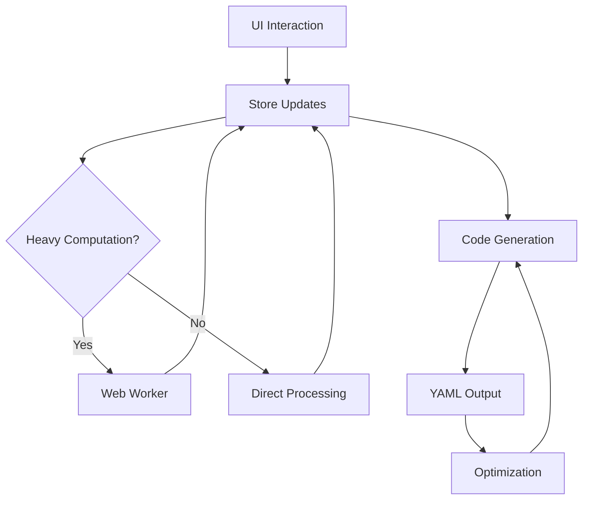

# AuraFX — Advanced Particle Effect Generator

> **3D/2D hybrid editor for creating dynamic particle effects with mathematical precision**

AuraFX is a sophisticated web-based particle effect generator that combines 2D drawing capabilities with 3D visualization, specifically designed for generating MythicMobs YAML configurations. Built with modern web technologies and mathematical algorithms for optimal performance and accuracy.

## 🎯 Core Features

### 🎨 **Dual Editor System**
- **2D Canvas Editor**: Fast point/shape-based particle placement with drawing tools
- **3D Scene Editor**: Advanced vertex management with instanced rendering and transform controls
- **Seamless Integration**: Bidirectional import/export between 2D and 3D workflows

### 📁 **Multi-Format Import System**
- **PNG Processing**: Edge detection using Canny algorithm + Zhang-Suen skeletonization
- **OBJ 3D Models**: Direct vertex extraction and conversion
- **GIF Animation**: Frame-by-frame analysis with gifuct-js
- **YAML Parsing**: Import existing MythicMobs configurations

### ⚡ **Animation & Motion Modes**
- **Global Rotation**: Orbital motion around center point
- **Local Rotation**: Individual element self-rotation
- **Directional Movement**: 8-direction movement with elevation control
- **Dynamic Rainbow**: HSV→RGB color transitions with customizable periods
- **Chain Animation**: Sequential pulse effects with configurable delays

### 🔧 **Advanced Tools**
- **Performance Optimizer**: Line reduction, sampling, and interval optimization
- **Transform Controls**: Batch rotation, scaling, and translation
- **Selection Tools**: Box selection with occlusion detection
- **LOD System**: Distance-based level-of-detail rendering

## 🧮 Mathematical Foundations

### **Circle Generation (2D)**
```
θᵢ = 2π·i/N
x = r·cos(θᵢ), z = r·sin(θᵢ)
```

### **Fibonacci Sphere Distribution**
```
φ = (1 + √5)/2  (Golden ratio)
Δ = 2π/φ        (Incremental angle)
t = i/N
ι = arccos(1 − 2t)    (Inclination)
α = Δ·i               (Azimuth)

x = r·sin(ι)·cos(α)
y = r·cos(ι)  
z = r·sin(ι)·sin(α)
```

### **Global Rotation Mode**
```
θ(t) = 2π·t/Frames
x' = Cx + r·cos(θ₀+θ)
z' = Cz + r·sin(θ₀+θ)
```

### **HSV to RGB Color Conversion**
Dynamic rainbow implementation with period-based hue cycling:
```
hue(t) = (t/period) mod 1
```

### **Perspective Projection (2D Preview)**
```
s = fov/(fov + z₂)
X = cx + s·x₁
Y = cy + s·y₁
```

## 🏗️ Architecture Overview

```
┌─────────────┬─────────────┬─────────────┐
│   UI Layer  │  State Mgmt │  Compute    │
├─────────────┼─────────────┼─────────────┤
│ Drawing     │ Zustand 2D  │ Web Workers │
│ Modes       │ Zustand 3D  │ Transform   │
│ Import      │ Map-based   │ Selection   │
│ Code        │ Stores      │ Chain Anim  │
└─────────────┴─────────────┴─────────────┘
```

### **Technology Stack**
- **Frontend**: Next.js 15, React 18, TypeScript 5
- **3D Graphics**: Three.js, @react-three/fiber, @react-three/drei
- **State Management**: Zustand with immer and subscribeWithSelector
- **Styling**: TailwindCSS, shadcn/ui components
- **Animations**: Framer Motion
- **Processing**: OpenCV.js, gifuct-js, js-yaml

## ⚡ Performance Optimizations

### **GPU-Accelerated Rendering**
- **Instanced Rendering**: Thousands of particles in single draw call
- **LOD System**: Distance-based detail reduction
- **Batch Operations**: Non-blocking UI updates

### **Web Worker Integration**
- **Selection Worker**: Box selection calculations
- **Transform Worker**: Bulk rotation/scaling operations  
- **Chain Animation Worker**: Sequential timing calculations

### **Smart Code Generation**
- **Circle Detection**: Multi-point → single `particlering` command
- **Sampling Algorithms**: Grid/step/random/center-based reduction
- **Interval Optimization**: Automatic timing adjustments

## 🔄 Data Flow



## 🎛️ Key Components

### **2D Canvas Editor**
- Real-time drawing with circle/line/freehand tools
- Selection and transformation capabilities
- 3D preview with perspective projection
- Layer-based organization

### **3D Scene Editor**
- Instanced mesh rendering for performance
- Transform controls with gizmos
- Selection box with occlusion detection
- Camera controls with zoom/pan/orbit

### **Import System**
- **PNG**: Edge detection → skeleton → sampling
- **GIF**: Frame extraction → pixel analysis → temporal sampling
- **OBJ**: Vertex parsing → coordinate transformation
- **YAML**: Configuration parsing → element reconstruction

### **Code Generator**
- Multi-mode animation support
- Mathematical formula implementation
- Automatic optimization detection
- MythicMobs-compatible output

## 🔬 Advanced Features

### **Circle Optimization**
Automatic detection of circular patterns:
```
Center: (x̄, z̄) = average position
Radius: r ≈ average(√((x-x̄)² + (z-z̄)²))
Validation: rσ < 0.2·r (standard deviation threshold)
```

### **Chain Animation**
Sequential pulse effects with phase calculation:
```
φ = (t − delayᵢ) mod (2·T)
I = 0.5·(sin(π·φ/T) + 1)  (0..1 normalization)
```

### **Euler Transformations**
X→Y→Z rotation sequence:
```
X-axis: y' = y·cosx − z·sinx, z' = y·sinx + z·cosx
Y-axis: x'' = x'·cosy + z'·siny, z'' = −x'·siny + z'·cosy  
Z-axis: x''' = x''·cosz − y''·sinz, y''' = x''·sinz + y''·cosz
```

## 🎨 User Experience

- **Modern UI**: shadcn/ui components with Tailwind styling
- **Responsive Design**: Works across desktop and tablet devices
- **Real-time Preview**: Live 2D/3D visualization during editing
- **Performance Monitoring**: Automatic performance mode suggestions
- **Export Options**: Direct YAML download with optimization

## 🧰 Development Architecture

### **Store Management**
- **Map-based Vertex Storage**: O(1) access for large datasets
- **Batch Updates**: Non-blocking UI with requestIdleCallback
- **History System**: Undo/redo functionality
- **Cross-store Synchronization**: 2D ↔ 3D data flow

### **Worker Integration**
- **Selection Worker**: `selectionWorker.ts` - Box selection calculations
- **Transform Worker**: `transform-worker.ts` - Bulk transformations
- **Chain Worker**: `chainAnimationWorker.ts` - Animation timing

### **Optimization Pipeline**
- **Element Sampling**: Grid/step/random/center algorithms
- **Line Reduction**: Similar effect merging
- **Interval Scaling**: Automatic timing optimization
- **Primitive Detection**: Circle/line pattern recognition

## 📊 Mathematical Accuracy

All calculations use double-precision floating-point arithmetic with:
- **Trigonometric Functions**: Native Math.cos/sin for rotation calculations
- **Color Space Conversion**: Sector-based HSV→RGB transformation
- **Projection Mathematics**: Perspective-correct 3D→2D mapping
- **Statistical Analysis**: Mean/variance calculations for pattern detection

---

**Built with precision. Optimized for performance. Designed for creators.**

made by sleepsweety
